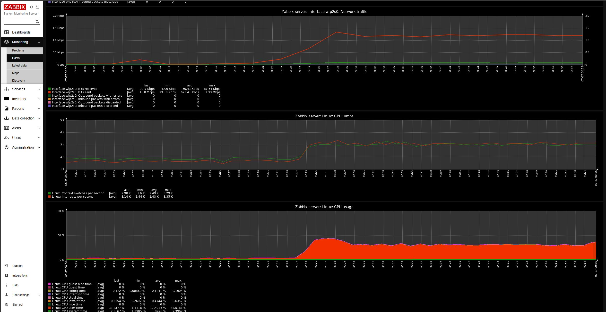

# 🚀 Automated Ubuntu Server Setup with Apache2, Zabbix, and Grafana

This Ansible playbook automates the setup of an Ubuntu server with Apache2 web server, Zabbix monitoring, and Grafana visualization. Perfect for quickly deploying a production-ready monitoring environment.

## 🎯 Features

- ✨ Apache2 web server configuration
- 📊 Zabbix 6.0 monitoring server and agent
- 📈 Grafana 9.5.2 visualization platform
- 🔒 MySQL database setup for Zabbix
- 🛡️ Basic security configurations
- 🌐 Ready for Cloudflare Tunnel integration

## 🔧 Prerequisites

- Ubuntu Server (tested on Ubuntu 22.04 LTS)
- Ansible 2.9 or higher on the control machine
- SSH access to the target server
- Python 3.x on the target server

## 📋 What Gets Installed

- Apache2 with SSL and rewrite modules
- MySQL Server
- Zabbix 6.0 (Server, Frontend, and Agent2)
- Grafana 9.5.2
- Various dependencies and utilities

## � Implementation Screenshots





## �🚀 Quick Start

1. Clone this repository:
   ```bash
   git clone https://github.com/yourusername/ubuntu-server-ansible-apache2-setup.git
   cd ubuntu-server-ansible-apache2-setup
   ```

2. Update the inventory file (`inventory.ini`) with your server details:
   ```ini
   [Ubuntu_server]
   your_server_ip ansible_user=ubuntu
   ```

3. Review and modify variables in `playbook.yml` if needed:
   ```yaml
   vars:
     zabbix_server_db_password: "change_this_password"  # Change this!
   ```

4. Run the playbook:
   ```bash
   ansible-playbook -i inventory.ini playbook.yml
   ```

## 🔐 Default Credentials

After installation, you can access the following services:

### Zabbix
- URL: http://your_server_ip/zabbix
- Username: Admin
- Password: zabbix

### Grafana
- URL: http://your_server_ip:3000
- Username: admin
- Password: admin

⚠️ **Important**: Change these default passwords immediately after first login!

## 🛠️ Configuration Details

### Ports Used
- Apache2: 80
- Zabbix Server: 10051
- Zabbix Agent: 10050
- Grafana: 3000
- MySQL: 3306

### File Locations
- Apache2 Config: `/etc/apache2/`
- Zabbix Server Config: `/etc/zabbix/zabbix_server.conf`
- Zabbix Agent Config: `/etc/zabbix/zabbix_agent2.conf`
- Grafana Config: `/etc/grafana/grafana.ini`

## 🔒 Security Considerations

1. Change all default passwords
2. Consider implementing SSL/TLS
3. Configure firewall rules
4. Regular system updates
5. Follow security best practices for production environments

## 🌐 Cloudflare Tunnel Setup (Manual Steps)

After installation, follow these steps to set up Cloudflare Tunnels:

1. Install cloudflared
2. Create tunnels for each service:
   - Website (Apache2)
   - Zabbix UI
   - Grafana

## 🔍 Troubleshooting

Common issues and solutions:

1. **Zabbix Server Won't Start**
   - Check MySQL credentials in zabbix_server.conf
   - Verify database permissions
   - Check Zabbix server logs: `/var/log/zabbix/zabbix_server.log`

2. **Database Connection Issues**
   - Verify MySQL is running: `systemctl status mysql`
   - Check user permissions
   - Verify database exists

3. **Web Interface Issues**
   - Check Apache logs: `/var/log/apache2/error.log`
   - Verify PHP configuration
   - Check SELinux if enabled

## 📝 License

This project is licensed under the MIT License - see the LICENSE file for details.

## ✨ Contributing

Contributions are welcome! Please feel free to submit a Pull Request.

## 🙏 Acknowledgments

- Zabbix Team for their excellent monitoring solution
- Grafana Labs for their visualization platform
- The Ansible community for their valuable resources

## 📞 Support

For support, please open an issue in the GitHub repository.

---

⭐ If you find this project helpful, please give it a star on GitHub!
